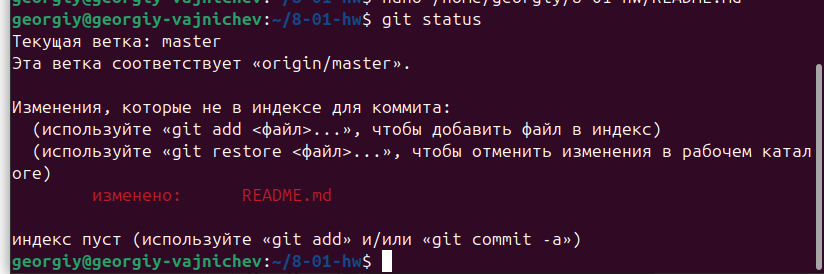
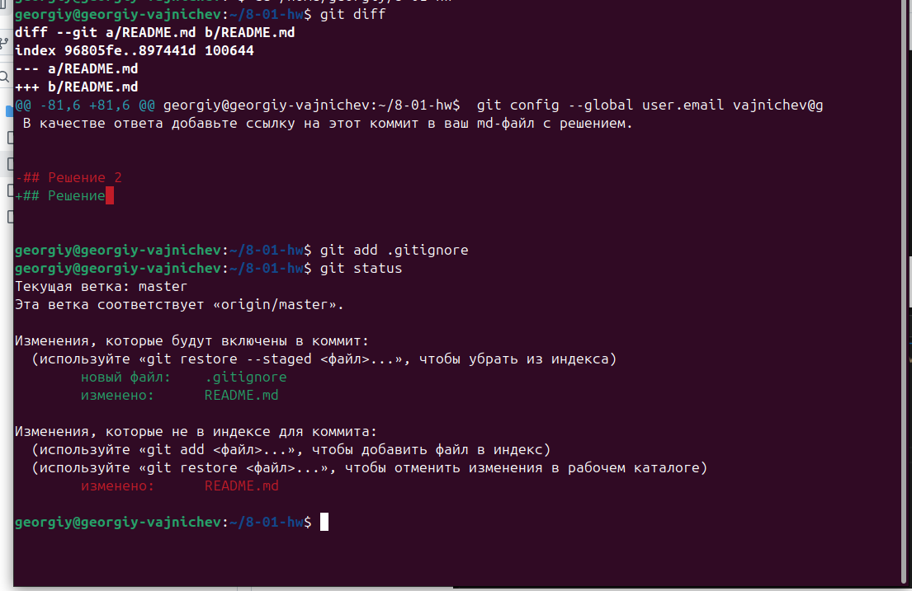
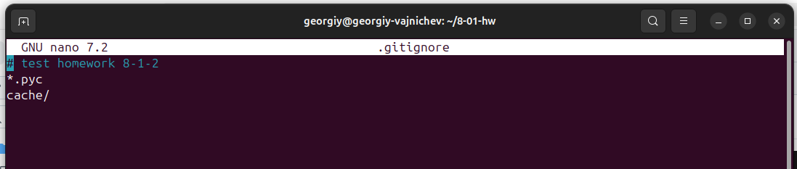
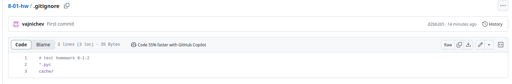
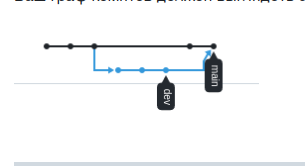
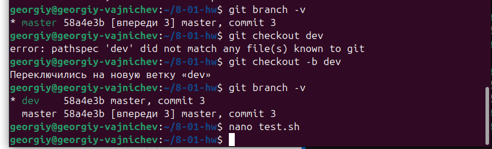
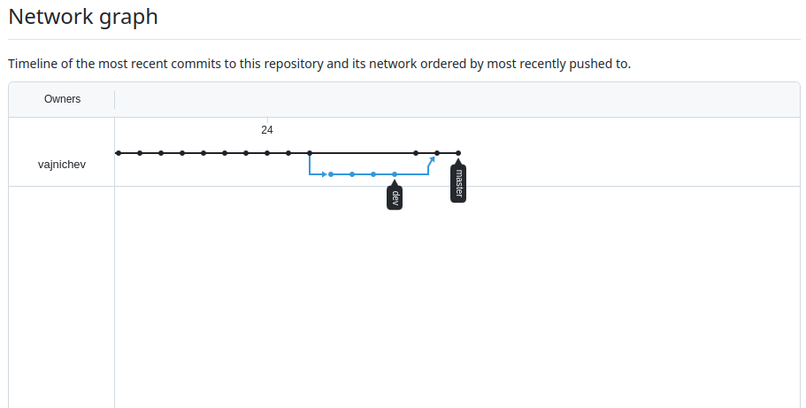

# # Домашнее задание к занятию "`Git`" - `Важничев Георгий`

## Задание 1

**Что нужно сделать:**

1. Зарегистрируйте аккаунт на [GitHub](https://github.com/).More actions

2. Создайте  **новый отдельный публичный репозиторий**. Обязательно поставьте галочку в поле «Initialize this repository with a README».
3. Склонируйте репозиторий, используя https протокол `git clone ...`.
4. Перейдите в каталог с клоном репозитория.
5. Произведите первоначальную настройку Git, указав своё настоящее имя и email: `git config --global user.name` и `git config --global user.email johndoe@example.com`.
6. Выполните команду `git status` и запомните результат.
7. Отредактируйте файл README.md любым удобным способом, переведя файл в состояние Modified.
8. Ещё раз выполните `git status` и продолжайте проверять вывод этой команды после каждого следующего шага.
9. Посмотрите изменения в файле README.md, выполнив команды `git diff` и `git diff --staged`.
10. Переведите файл в состояние staged или, как говорят, добавьте файл в коммит, командой `git add README.md`.
11. Ещё раз выполните команды `git diff` и `git diff --staged`.
12. Теперь можно сделать коммит `git commit -m 'First commit'`.
13. Сделайте `git push origin master`.

В качестве ответа добавьте ссылку на этот коммит в ваш md-файл с решением.

**Решение**

## Решение 1

1-6

georgiy@georgiy-vajnichev:~/8-01-hw$ cd ~/8-01-hw

georgiy@georgiy-vajnichev:~/8-01-hw$ git init

georgiy@georgiy-vajnichev:~/8-01-hw$  git config --global user.name GeorgiyVajnichev

georgiy@georgiy-vajnichev:~/8-01-hw$  git config --global user.email vajnichev@gmail.com

7-11
добавим отслеживание

Коммит после решения  

[ссылка](https://github.com/vajnichev/8-01-hw/blob/master/README.md?plain=1)

###Задание 2

Что нужно сделать:

    Создайте файл .gitignore (обратите внимание на точку в начале файла) и проверьте его статус сразу после создания.
    Добавьте файл .gitignore в следующий коммит git add....
    Напишите правила в этом файле, чтобы игнорировать любые файлы .pyc, а также все файлы в директории cache.
    Сделайте коммит и пуш.

В качестве ответа добавьте ссылку на этот коммит в ваш md-файл с решением.

## Решение 2

1-2.

3.

4.

Коммит после решения 

[ссылка](https://github.com/vajnichev/8-01-hw/blob/master/README.md?plain=1)

### Задание 3

1. Создайте новую ветку dev и переключитесь на неё.
2. Создайте в ветке dev файл test.sh с произвольным содержимым.
3. Сделайте несколько коммитов и пушей в ветку dev, имитируя активную работу над  
    файлом в процессе разработки.
4. Переключитесь на основную ветку.
5. Добавьте файл main.sh в основной ветке с произвольным содержимым, сделайте комит и пуш . Так имитируется продолжение общекомандной разработки в основной ветке во время разработки отдельного функционала в dev ветке.
6. Сделайте мердж dev ветки в основную с помощью git merge dev. Напишите осмысленное сообщение в появившееся окно комита.
7. Сделайте пуш в основной ветке.
8. Не удаляйте ветку dev.

В качестве ответа прикрепите ссылку на граф коммитов https://github.com/ваш-логин/ваш-репозиторий/network в ваш md-файл с решением.

Ваш граф комитов должен выглядеть аналогично скриншоту:

## Решение 3.

1-3.  

git add .  
git status 
git checkout -b dev  
git commit -am 'dev commit 1'  
git push origin dev  
Изменяем файл, несколько раз комиттим и пушим  
4.   
git branch -v   
git checkout master  
5.  
vim main.sh  
git add .  
git commit -am 'commit, master 4'  
git push origin master  
6.  
git merge dev  
7.  
git commit -am 'commit, master 5'  
git push origin master  

Ссылка на граф коммитов после решения  
[ссылка](https://github.com/vajnichev/8-01-hw/network)

